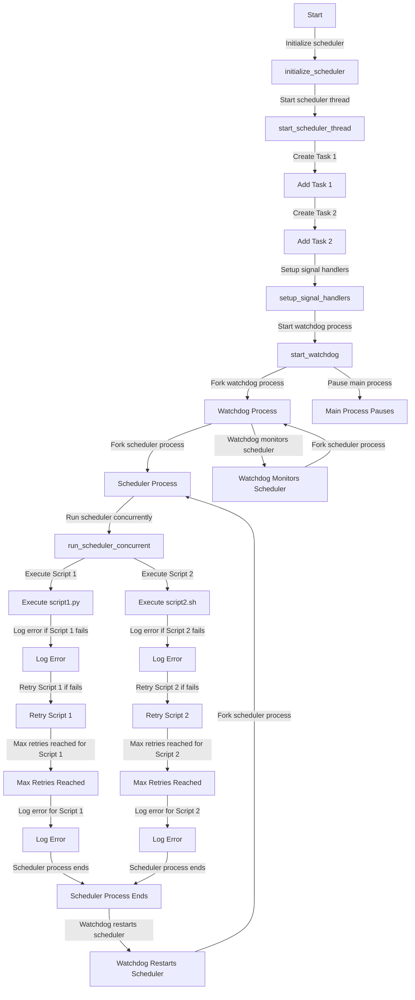

To make the script scheduling engine robust and resilient, you can implement several features and mechanisms. Here are some suggestions:



### 1. **Error Handling and Logging**
Implement detailed logging and error handling to capture and log all activities, errors, and exceptions.

#### Example:
```c
#include <errno.h>
#include <string.h>

void log_error(const char *message) {
    FILE *log_file = fopen("scheduler.log", "a");
    if (log_file) {
        fprintf(log_file, "ERROR: %s: %s\n", message, strerror(errno));
        fclose(log_file);
    }
}

void execute_script(const char *script) {
    // Existing code...
    if (system(command) != 0) {
        log_error("Failed to execute script");
    }
}
```

### 2. **Retry Mechanism**
Implement a retry mechanism for failed scripts to ensure they are re-executed a certain number of times before giving up.

#### Example:
```c
#define MAX_RETRIES 3

void execute_script_with_retries(const char *script) {
    int retries = 0;
    while (retries < MAX_RETRIES) {
        if (system(command) == 0) {
            return; // Success
        }
        retries++;
        log_error("Retrying script execution");
    }
    log_error("Max retries reached, giving up");
}
```

### 3. **Watchdog Process**
Implement a watchdog process to monitor the scheduler and restart it if it crashes.

#### Example:
```c
#include <unistd.h>
#include <sys/types.h>
#include <sys/wait.h>

void start_watchdog() {
    pid_t pid = fork();
    if (pid == 0) {
        // Child process: Watchdog
        while (1) {
            int status;
            pid_t scheduler_pid = fork();
            if (scheduler_pid == 0) {
                // Child process: Scheduler
                run_scheduler();
                exit(0);
            }
            waitpid(scheduler_pid, &status, 0);
            log_error("Scheduler crashed, restarting...");
        }
    }
}
```

### 4. **Timeout Mechanism**
Implement a timeout mechanism to terminate unresponsive scripts.

#### Example:
```c
#include <signal.h>
#include <sys/time.h>

void timeout_handler(int signum) {
    log_error("Script execution timed out");
    exit(1);
}

void execute_script_with_timeout(const char *script, int timeout) {
    struct itimerval timer;
    signal(SIGALRM, timeout_handler);
    timer.it_value.tv_sec = timeout;
    timer.it_value.tv_usec = 0;
    setitimer(ITIMER_REAL, &timer, NULL);

    if (system(command) != 0) {
        log_error("Failed to execute script");
    }

    timer.it_value.tv_sec = 0;
    timer.it_value.tv_usec = 0;
    setitimer(ITIMER_REAL, &timer, NULL);
}
```

### 5. **Concurrency**
Enable concurrent execution of multiple scripts using threading or multiprocessing.

#### Example:
```c
#include <pthread.h>

void *execute_script_thread(void *arg) {
    char *script = (char *)arg;
    execute_script(script);
    return NULL;
}

void run_scheduler_concurrent(void) {
    pthread_t threads[MAX_TASKS];
    for (int i = 0; i < task_count; i++) {
        pthread_create(&threads[i], NULL, execute_script_thread, (void *)task_queue[i].script_name);
    }
    for (int i = 0; i < task_count; i++) {
        pthread_join(threads[i], NULL);
    }
}
```

### 6. **Graceful Shutdown**
Implement a mechanism to handle graceful shutdowns and clean up resources.

#### Example:
```c
#include <signal.h>

void handle_shutdown(int signum) {
    log_error("Scheduler shutting down gracefully");
    // Clean up resources
    exit(0);
}

void setup_signal_handlers() {
    signal(SIGINT, handle_shutdown);
    signal(SIGTERM, handle_shutdown);
}
```

### Integration
Integrate these features into your scheduler:

#### 

scheduler.c


```c
#include "scheduler.h"
#include "func.h"
#include <stdio.h>
#include <stdbool.h>
#include <signal.h>
#include <pthread.h>
#include <unistd.h>
#include <sys/types.h>
#include <sys/wait.h>

#define MAX_TASKS 10
#define MAX_RETRIES 3

static Task task_queue[MAX_TASKS];
static int task_count = 0;

void log_error(const char *message) {
    FILE *log_file = fopen("scheduler.log", "a");
    if (log_file) {
        fprintf(log_file, "ERROR: %s: %s\n", message, strerror(errno));
        fclose(log_file);
    }
}

void execute_script_with_retries(const char *script) {
    int retries = 0;
    while (retries < MAX_RETRIES) {
        if (system(script) == 0) {
            return; // Success
        }
        retries++;
        log_error("Retrying script execution");
    }
    log_error("Max retries reached, giving up");
}

void *execute_script_thread(void *arg) {
    char *script = (char *)arg;
    execute_script_with_retries(script);
    return NULL;
}

void run_scheduler_concurrent(void) {
    pthread_t threads[MAX_TASKS];
    for (int i = 0; i < task_count; i++) {
        pthread_create(&threads[i], NULL, execute_script_thread, (void *)task_queue[i].script_name);
    }
    for (int i = 0; i < task_count; i++) {
        pthread_join(threads[i], NULL);
    }
}

void handle_shutdown(int signum) {
    log_error("Scheduler shutting down gracefully");
    // Clean up resources
    exit(0);
}

void setup_signal_handlers() {
    signal(SIGINT, handle_shutdown);
    signal(SIGTERM, handle_shutdown);
}

void initialize_scheduler(void) {
    setup_signal_handlers();
    printf("Scheduler Initialized.\n");
}

void run_scheduler(void) {
    printf("Scheduler Running.\n");
    run_scheduler_concurrent();
}

void start_watchdog() {
    pid_t pid = fork();
    if (pid == 0) {
        // Child process: Watchdog
        while (1) {
            int status;
            pid_t scheduler_pid = fork();
            if (scheduler_pid == 0) {
                // Child process: Scheduler
                run_scheduler();
                exit(0);
            }
            waitpid(scheduler_pid, &status, 0);
            log_error("Scheduler crashed, restarting...");
        }
    }
}
```

By implementing these features, you can make your script scheduling engine more robust and resilient, ensuring it runs continuously and handles various failure scenarios gracefully.
